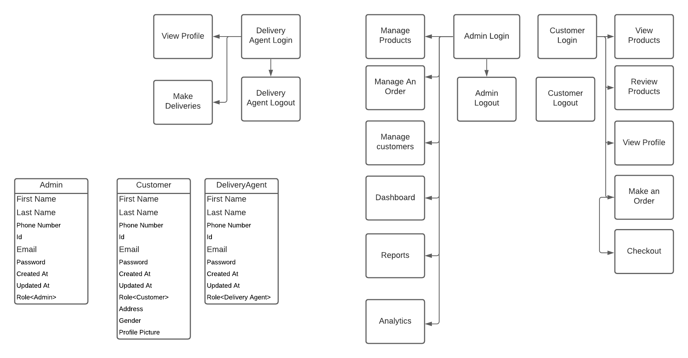

     
# Ecommerce-Backend
# ecommerce # authentication # reCAPTCHA
## Ecommerce Backend

## Description
Basically, project for ecommerce backend
#### Features
1. Authentication and Authorization: 
- Ability to register as an admin,delivery agent and as a customer
- Email verification and email subscription to newsletters 
- Ability to login and log out
- Remember me functionality
- reCAPTCHA implementation 
- Reset password implementation
- Dark theme implementation for the UI 

2. Use database seeds to create first user with email admin@admin.com and password “password”
3. CRUD functionality (Create / Read / Update / Delete) for the various products,customers,orders
   

Basically, that’s it. This project shows the skills in basic django things:
1. MVC
2. Authuthentication and Authorization
3. CRUD and Resource Controllers
4. Eloquent and Relationships
5. Database migrations and seeds
6. Form Validation and Requests
7. File management
8. Basic Bootstrap front-end
9. Pagination
10. Ecommerce

## Installation
### To use the repository:
1. Clone the repository to a specified directory in your local machine.
2. Make sure python is installed in your local machine.
3. Use any of your favourite ide to view the code or make modifications to it.
4. Create a python environment wiith conda create --name myenv python=3.6
5. Install the requirements.txt with python -m pip install -r requirements.txt
6. Create a django project with django-admin startproject crm
7. Chabnge the directory to crm then run django-admin startapp api
8. Confirm everything is okay with python manage.py runserver
9. Run migrations with python manage.py makemigrations api then python manage.py makemigrations api then python manage.py migrate

### Live Link
The project is hosted on this link <> .

## Contributing
This repository is owned by <https://github.com/EstherWaweru> . To contribute to this project raise an issue .

### Database ERP Diagram

### Module Diagram

